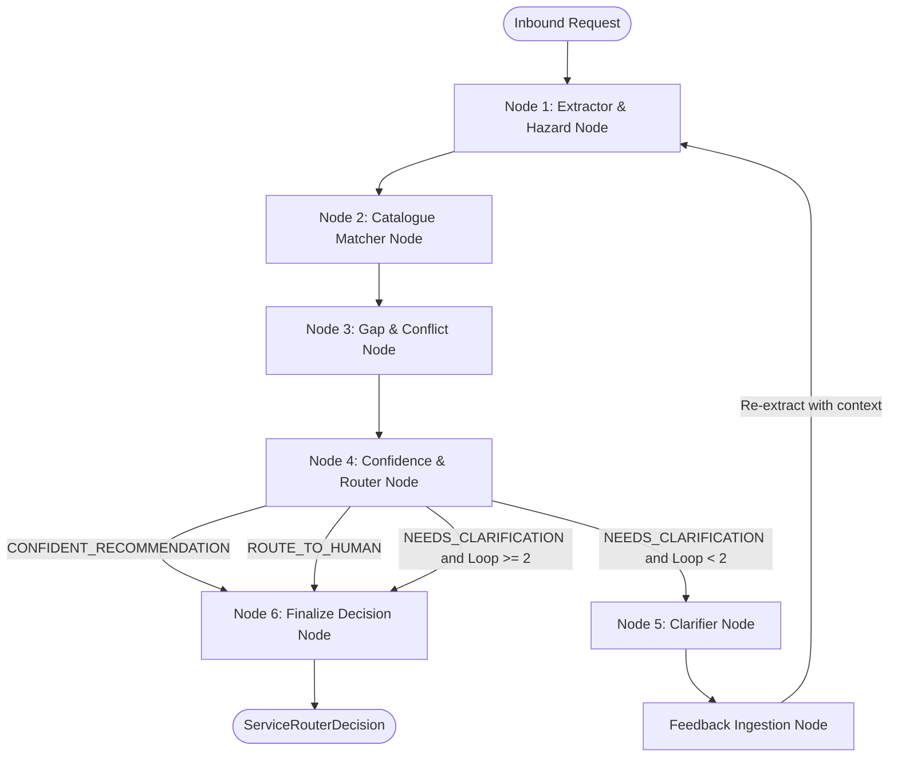

# Field Services Intelligent Dispatcher (FS-ID)

[](https://www.python.org/downloads/)
[](https://github.com/langchain-ai/langgraph)
[](https://docs.pydantic.dev/)
[]()

The **Field Services Intelligent Dispatcher (FS-ID)** is an autonomous agentic routing engine designed for operational dispatch desks. It ingests unstructured, ambiguous, and emotionally charged customer maintenance requests, identifies critical safety hazards, extracts physical entities, maps symptoms against a dynamic service catalogue, and issues deterministic dispatch routing actions accompanied by confidence scores and causal rationales.

---

## Table of Contents

- [System Architecture](#system-architecture)
- [Project Directory Structure](#project-directory-structure)
- [Prerequisites & Environment Setup](#prerequisites--environment-setup)
- [How to Run the System](#how-to-run-the-system)
  - [1. Interactive CLI / TUI](#1-interactive-cli--tui)
  - [2. Dynamic In-Session Evaluation](#2-dynamic-in-session-evaluation)
  - [3. Offline Benchmark Suite](#3-offline-benchmark-suite)
- [Example Inputs & Outputs](#example-inputs--outputs)
- [Data Science Evaluation Suite](#data-science-evaluation-suite)
- [Known Limitations & Operational Boundaries](#known-limitations--operational-boundaries)
- [Documentation & Artifacts](#documentation--artifacts)

---

## System Architecture

FS-ID is built on a **deterministic 6-node LangGraph state machine** rather than a loose ReAct agent. This guarantees bounded execution, zero hallucinations, and predictable SLAs.



### Core Design Principles

1. **Hybrid Cognitive & Algorithmic Design**: LLMs handle linguistic ambiguity and semantic matching (Temperature = 0.0). Pure Python deterministic algorithms handle trade pre-filtering, margin collision detection, and intake validation.
2. **Hazard Dominance Rule**: Life-safety hazards (fire, smoke, active leaks near power, gas, trapped occupants) unconditionally escalate real urgency to **P1**, overriding polite customer sentiment or minor symptoms.
3. **Bounded Clarification Loop**: If required intake fields are missing and confidence is moderate ($0.45 \le C < 0.75$), the agent asks 1–3 targeted questions. The loop is strictly bounded to $K \le 2$ turns; persistent ambiguity automatically escalates to `ROUTE_TO_HUMAN`.
4. **Abstracted LLM Layer**: All cognitive operations use the `BaseLLMClient` adapter pattern, allowing instant switching between Google Gemini, OpenAI, and Anthropic.

---

## Project Directory Structure

```
agentic-service-router/
├── data/                                 # Central data store
│   ├── service_catalogue.json            # READ-ONLY: 8 service workflow templates & SLAs
│   ├── test_requests.json                # READ-ONLY: 8 core benchmark test requests
│   ├── custom-hard-requests.json         # READ/WRITE: 3 custom adversarial edge cases
│   ├── eval_cases.json                   # Ground truth assertions (REQ-001 to REQ-011)
│   └── evaluation_results.json           # Cached full benchmark execution log
│
├── src/                                  # Primary application package
│   ├── main.py                           # CLI / TUI Interactive Entry Point
│   ├── catalogue.py                      # Service Catalogue Singleton & O(1) Lookups
│   ├── config.py                         # Centralized Configuration & Environment
│   ├── models.py                         # Centralized Pydantic v2 Data Contracts
│   │
│   ├── core/                             # Agent orchestration & state machine
│   │   ├── agent.py                      # TriageAgent wrapper & Mermaid export
│   │   ├── graph.py                      # LangGraph StateGraph & conditional edges
│   │   └── state.py                      # TriageState TypedDict
│   │
│   ├── cli/                              # Terminal presentation & live evaluation
│   │   ├── cli.py                        # Rich TUI formatting, panels, tables, prompts
│   │   └── session_tracker.py            # Batch Data Science metrics & report engine
│   │
│   ├── llm/                              # LLM abstraction adapters
│   │   ├── base.py                       # BaseLLMClient Abstract Base Class
│   │   ├── factory.py                    # LLMClientFactory
│   │   └── gemini_adapter.py             # Google Gemini (google.genai SDK) adapter
│   │
│   ├── nodes/                            # 6 LangGraph cognitive nodes
│   │   ├── extractor_node.py             # Node 1: Fact & hazard extraction
│   │   ├── matcher_node.py               # Node 2: Semantic catalogue candidate matching
│   │   ├── gap_node.py                   # Node 3: Intake gap & conflict detection
│   │   ├── router_node.py                # Node 4: Confidence scoring & action banding
│   │   ├── clarifier_node.py             # Node 5: Clarification questions & feedback loop
│   │   └── finalizer_node.py             # Node 6: Causal rationale & counterfactual synthesis
│   │
│   └── prompts/                          # Centralized prompt templates
│       ├── extractor_prompt.py
│       ├── matcher_prompt.py
│       ├── clarifier_prompt.py
│       ├── finalizer_prompt.py
│       └── simulated_answers.py          # Automated answers for benchmark testing
│
├── eval/                                 # Benchmark evaluation harness
│   ├── ground_truth.py                   # Ground truth parser & assertion tracker
│   ├── metrics.py                        # Mathematical metrics (F1, P1 Recall, Jaccard, ECE)
│   └── run_evaluation.py                 # Offline 11-case benchmark runner
│
├── docs/                                 # Architectural specifications & reports
│   ├── requirements/                     # SRS v4.3
│   ├── design/                           # SDD v1.2
│   ├── reports/                          # Benchmark Evaluation Reports (v1, v2)
│   ├── walkthroughs/                     # Per-task implementation walkthroughs
│   └── Implementation_Roadmap.md         # 5-Phase implementation checklist
│
├── requirements.txt                      # Project dependencies
└── README.md                             # This file
```

---

## Prerequisites & Environment Setup

### 1. Requirements
- **Python 3.10 or higher**
- An API key for your chosen LLM provider (**Google Gemini**, **Anthropic**, or **OpenAI**)

### 2. Virtual Environment Setup
Clone the repository and initialize a clean virtual environment:

```bash
# Create and activate virtual environment
python3 -m venv .venv
source .venv/bin/activate

# Install dependencies
pip install -r requirements.txt
```

### 3. Environment Variables & Provider Configuration
The system features an abstract LLM layer (`BaseLLMClient` with `LLMClientFactory`) supporting **Google Gemini**, **Anthropic (Claude)**, and **OpenAI**. Configure your preferred provider in a `.env` file in the project root:

```bash
cat << 'EOF' > .env
# Choose active provider: 'gemini', 'anthropic', or 'openai' (default: gemini)
LLM_PROVIDER=gemini

# Provide the API key for your selected provider:
GEMINI_API_KEY=your_gemini_api_key_here
ANTHROPIC_API_KEY=your_anthropic_api_key_here
OPENAI_API_KEY=your_openai_api_key_here

# Optional: Specific model overrides
# GEMINI_MODEL=gemini-3.5-flash-lite
# ANTHROPIC_MODEL=claude-3-5-sonnet-20241022
# OPENAI_MODEL=gpt-4o
EOF
```

---

## How to Run the System

### 1. Interactive CLI / TUI

The primary entry point is located in `src/main.py`. Launch it interactively:

```bash
# From the project root:
python src/main.py

# Alternatively, as a module:
python -m src.main
```

Upon startup, the system displays a welcome banner showing the active LLM provider, loads the service catalogue, and opens an interactive prompt:

```text
╭──────────────────────────────────────────────────────────────────────────────╮
│   ⚡ FS-ID Triage Agent                                                      │
│   Field Services Intelligent Dispatcher                                      │
│                                                                              │
│   Architecture: LangGraph 6-Node State Machine                               │
│   LLM Engine:   GEMINI (Multi-Provider Support: Gemini / Anthropic / OpenAI) │
│   Pipeline:     Real-Time Triage • Dynamic Evaluation Tracking               │
╰──────────────────────────────────────────────────────────────────────────────╯

FS-ID > 
```

#### Available CLI Commands:
- `/eval` — Toggle live Data Science evaluation tracking mode on/off.
- `/metrics` — Display the current accumulated Data Science benchmark matrices.
- `/history` — Show all queries processed in the current session in a formatted table.
- `/report` — Export the session evaluation results to a JSON file in `data/`.
- `/catalogue` — Display the full 8-template service catalogue and SLAs.
- `/help` — Display command usage instructions.
- `quit` or `exit` — Exit the interactive interface (auto-exports final report).

---

### 2. Dynamic In-Session Evaluation

When evaluation mode is toggled on (`/eval`), the system tracks user queries dynamically and collects ground truth:

1. After each routing result is displayed, the CLI asks for feedback:
   ```text
   Was this routing correct? [y/n/skip] (y):
   ```
2. If `y` is entered, the prediction is marked as ground truth correct.
3. If `n` is entered, the CLI prompts for ground truth corrections:
   - Correct template choice from catalogue
   - Expected routing action (`CONFIDENT`, `CLARIFY`, `HUMAN`)
   - Expected urgency tier (`P1`, `P2`, `P3`)
   - Missing required intake fields
4. **Batch Evaluation Trigger**: Every **3 evaluated cases**, the system automatically calculates the full Data Science evaluation suite (Confusion Matrix, Macro F1, P1 Safety Recall, Jaccard IoU, Brier Score, ECE) and exports a batch report to `data/session_batch_<num>_<timestamp>.json`.

---

### 3. Offline Benchmark Suite

To run the full 11-case benchmark against the static test cases (`data/test_requests.json` and `data/custom-hard-requests.json`):

```bash
# Run silent benchmark
python eval/run_evaluation.py

# Run verbose benchmark (prints cognitive trace per case)
python eval/run_evaluation.py --verbose
```

This generates `data/evaluation_results.json` and prints the evaluation report.

---

## Example Inputs & Outputs

### Example 1: P1 Life-Safety Hazard Override

**Input:**
```text
FS-ID > The electrical panel in the basement is buzzing loudly, smells like scorched rubber, and sparking intermittently.
```

**Output:**
```text
╭───────────────────────────── 🎯 Triage Decision ─────────────────────────────╮
│  Template:   ELEC_FAULT                                                      │
│  Action:     ✅ CONFIDENT_RECOMMENDATION                                     │
│  Confidence: ████████████████████  0.95                                      │
│  Urgency:    P1 (Emergency - 4h SLA)                                         │
│                                                                              │
│  ─── Extracted Entities ───                                                  │
│  Trade: Electrical | Safety: ⚠️ Hazard Detected (life-safety)                 │
│  Stated Urgency: Unspecified → Real Urgency: P1                              │
│  Symptom: Electrical panel buzzing, burning rubber smell, sparking           │
│                                                                              │
│  ─── Rationale ───                                                           │
│  Template ELEC_FAULT was matched due to sparking electrical components.     │
│  Urgency escalated to P1 under the Hazard Dominance Rule due to immediate    │
│  fire risk, overriding lack of stated urgency. Required fields satisfied.    │
│                                                                              │
│  ─── Counterfactual ───                                                      │
│  If no active sparks or thermal burning were present, urgency would relax to │
│  P3 routine maintenance.                                                     │
╰──────────────────────────────────────────────────────────────────────────────╯
```

---

### Example 2: Incomplete Request Requiring Clarification

**Input:**
```text
FS-ID > One of the taps in the 4th floor kitchenette has a slow drip.
```

**Output:**
- Initial Router Action: `NEEDS_CLARIFICATION` ($C = 0.70$, missing `site_location`).
- Clarifier Node: Generates question: *"Could you specify the building address or site location for this repair?"*
- Feedback Node: Resolves location via conversational context.
- Final Output: Resolved to `PLUMB_STD` ($P3$, 120h SLA) with confidence $0.95$.

---

### Example 3: Ambiguous Multi-Trade Collision (Human Escalation)

**Input:**
```text
FS-ID > Drilled into basement wall, hit textured insulation with white powder. Headache, need patch & air test.
```

**Output:**
- Routing Action: `ROUTE_TO_HUMAN` (Out-of-catalogue hazardous material / asbestos concern).
- Real Urgency: `P1` (occupant health hazard).
- Rationale: Cross-trade ambiguity and hazardous material exposure exceed single-trade dispatch bounds; requires manual environmental hazard triage.

---

## Data Science Evaluation Suite

The evaluation suite implements strict quantitative KPIs grounded in data science standards:

| Section | Metric | Production Target | Description |
| :--- | :--- | :---: | :--- |
| **1. Action Routing** | **Macro-Averaged F1** | $\ge \mathbf{0.850}$ | Unweighted mean F1 across Confident, Clarify, and Human classes. |
| | **Weighted F1** | N/A | F1 weighted by class frequencies. |
| | **Per-Class P / R / F1** | N/A | Individual precision and recall per routing action. |
| **2. Safety Critical** | **P1 Safety Recall** | $\mathbf{100.0\%}$ | Zero tolerance for misclassifying P1 hazards as routine. |
| | **P1 False Negative Rate** | $\mathbf{0.0\%}$ | Proportion of true P1 cases missed by the agent. |
| | **Safety Cost Penalty** | $\mathbf{0}$ | Weighted penalty function: $100 \times FN_{P1} + 5 \times FP_{P1}$. |
| **3. Extraction Quality** | **Template Accuracy** | $\ge \mathbf{90.0\%}$ | Exact template matching accuracy against ground truth. |
| | **Mean Jaccard IoU** | N/A | Set overlap of missing intake fields: $\frac{\|E \cap A\|}{\|E \cup A\|}$. |
| **4. Calibration** | **Brier Score** | $\le \mathbf{0.100}$ | Mean squared probability error: $\frac{1}{N}\sum(p_i - y_i)^2$. |
| | **Expected Calib. Error** | $\le \mathbf{0.100}$ | Bin-weighted difference between confidence and actual accuracy. |
| **5. Clarification Quality** | **Question Specificity** | $\ge \mathbf{0.800}$ | Proportion of questions targeting verified missing fields. |
| | **Redundancy Index** | $\le \mathbf{0.150}$ | Rate of questions asking for data already in the prompt. |
| | **Convergence Rate** | $\ge \mathbf{85.0\%}$ | Percent of clarification loops resolved within 2 turns. |

---

## Known Limitations & Operational Boundaries

1. **API Rate Limiting & Quotas**:
   - Depending on the configured provider and subscription tier (e.g. Gemini free tier 15 RPM, or Anthropic/OpenAI rate limit buckets), rapid back-to-back requests may encounter throttling. The offline benchmark runner enforces an inter-request delay to operate within provider rate limits.
2. **Strict Catalogue Scope**:
   - The catalogue supports 8 specific facility management templates (HVAC, Plumbing, Electrical, Lock/Access, Handyman). Requests outside these trades (e.g., hazmat, structural framing) intentionally route to `ROUTE_TO_HUMAN`.
3. **Bounded Turns ($K=2$)**:
   - The clarification cycle is strictly capped at 2 turns to prevent infinite loops. Requests failing resolution within 2 turns are forcibly routed to human dispatchers.
4. **Deterministic Single-Path State**:
   - The StateGraph is non-branching during node transitions; concurrent multi-trade dispatches (e.g., both plumbing flood AND electrical spark in one job) prioritize the dominant hazard.

---

## Documentation & Artifacts

- [Software Requirements Specification (SRS v4.3)](docs/requirements/SRS_Service_Request_Router_Agent_v4_3.md)
- [Software Design Document (SDD v1.2)](docs/design/SDD_Service_Request_Router_Agent_v1_2.md)
- [Implementation Roadmap](docs/Implementation_Roadmap.md)
- [Benchmark Evaluation Report (v2.0)](docs/reports/benchmark_report_v2.md)
- [Task 5.1 Walkthrough: CLI & Interactive Evaluation](docs/walkthroughs/task-5.1.md)
