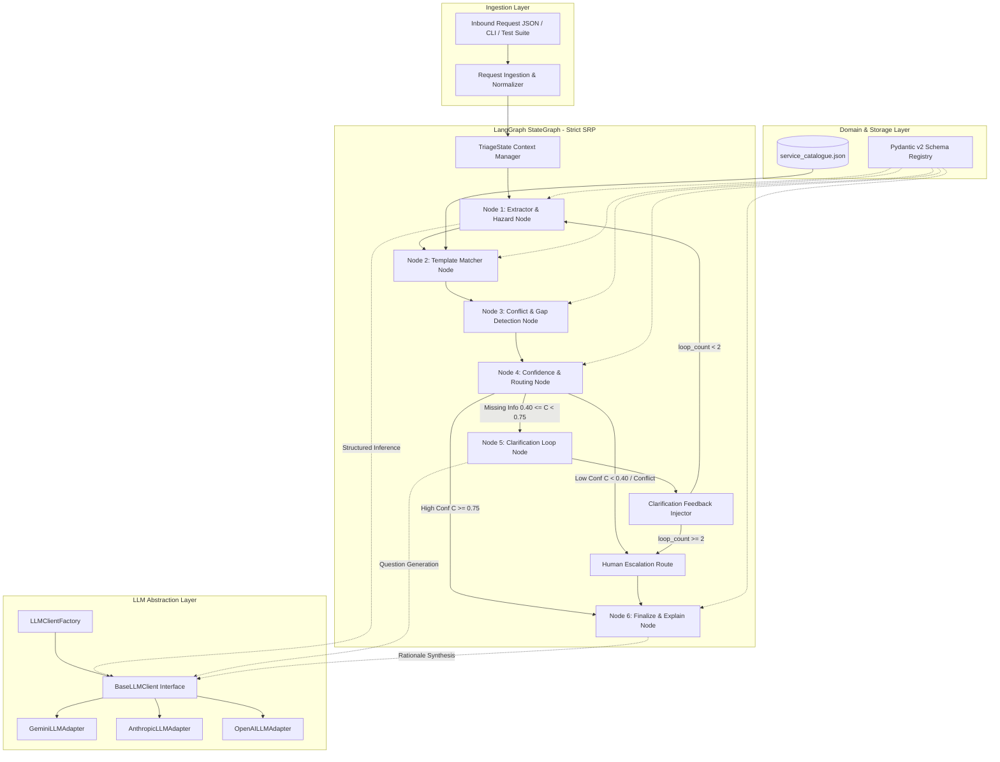
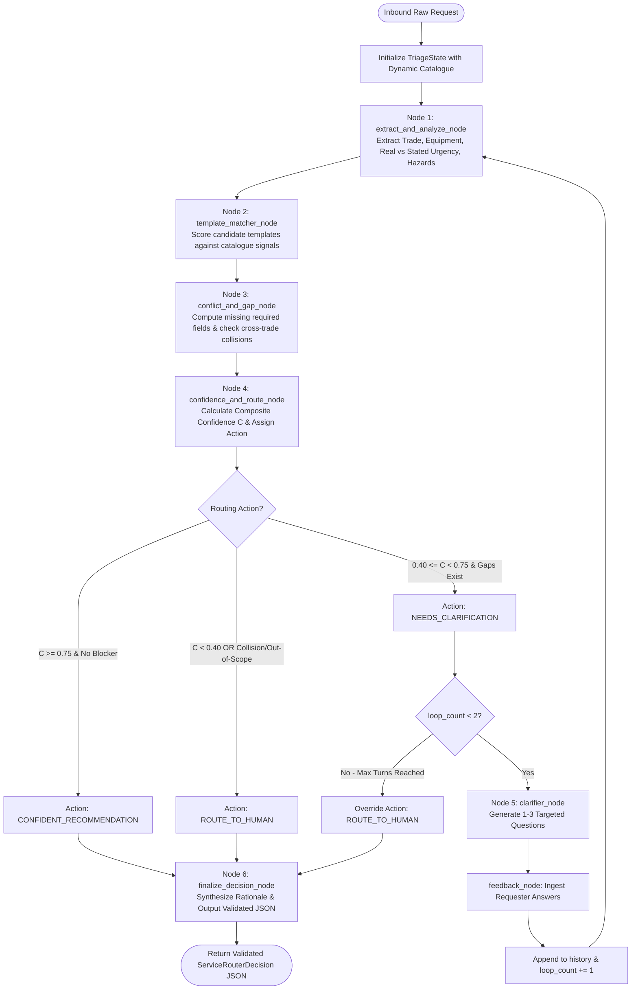
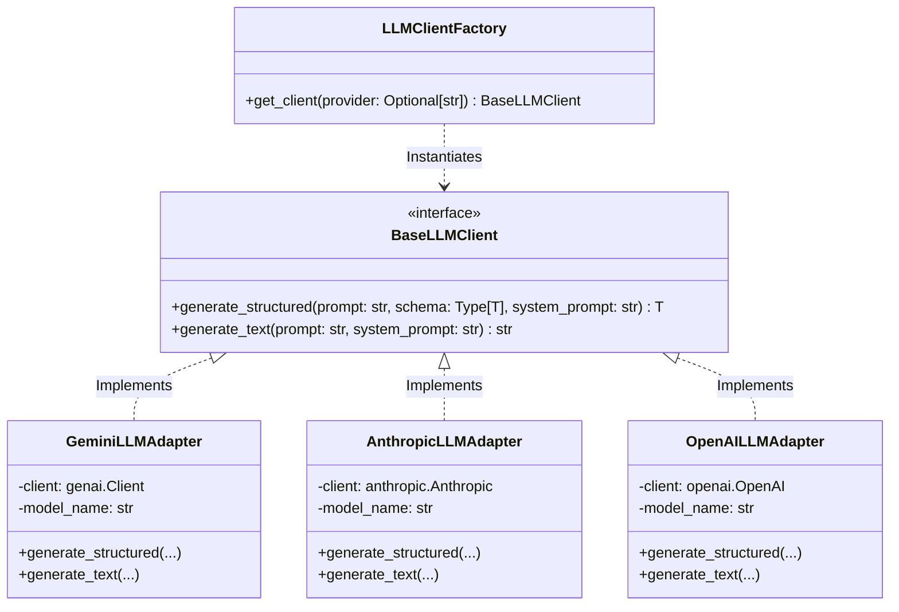
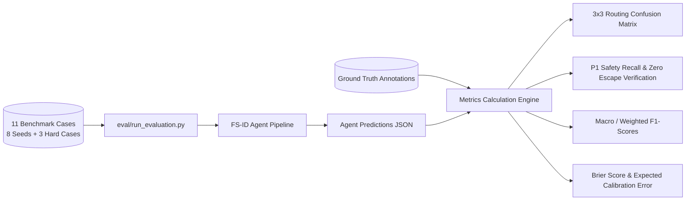

# Software Design Document (SDD)

## Autonomous Service Request Router & Triage Agent

**System Name:** Field Services Intelligent Dispatcher (FS-ID)  
**Document Version:** 1.2.0 (Strict SRP Node Decomposition & Agentic Pattern Evaluation)  
**Companion Document:** [Software Requirements Specification (SRS) v4.3.0](http://SRS_Service_Request_Router_Agent_v4_3.md)  
**Author:** Adi Wayn  
**Target Platform:** Python 3.11+, LangGraph StateGraph, Pydantic v2, Multi-LLM Abstract Provider (Google Gemini Primary, Anthropic Claude, OpenAI GPT)  
**Execution Sprint:** 24-Hour Implementation Horizon

---

## 1. Introduction, Architectural Goals & System Overview

### 1.1 Purpose of the SDD

This Software Design Document (SDD) defines the detailed internal technical architecture, modular decomposition, design patterns, algorithmic implementations, state machine workflows, prompt engineering strategies, and defensive resilience mechanisms for the **Autonomous Service Request Router & Triage Agent**.

While the companion **Software Requirements Specification (SRS)** defines the domain rules, functional contracts, and data science evaluation metrics (**WHAT** the system does), this document specifies the concrete software design, object-oriented abstractions, data structures, and code execution pipelines (**HOW** the system is built).

### 1.2 Core Architectural Goals & Trade-Offs

| Architectural Goal | Design Decision & Implementation Strategy | Trade-Off & Justification |
| :---- | :---- | :---- |
| **Thin-Slice 24h Feasibility** | **Modular Monolith in Python:** A cohesive, single-repository pipeline without distributed microservices or persistent database dependencies. | Avoids distributed networking, RPC, and deployment overhead while providing production-grade code structure. |
| **Multi-Provider LLM Agility** | **Abstract Provider Adapter:** Abstract `BaseLLMClient` with concrete implementations for Google Gemini (`GoogleGenAIClient`), Anthropic (`AnthropicClient`), and OpenAI (`OpenAIClient`). | Decouples cognitive triage logic from vendor-specific SDK APIs; model switching is zero-code via `LLM_PROVIDER` env var. |
| **Deterministic Reliability** | **Hybrid Pipeline (LLM Cognitive + Algorithmic Gates):** LLM handles semantic entity extraction and language generation; deterministic Python logic enforces schemas, cross-trade collision detection, confidence formulas, and routing thresholds. | Eliminates hallucinations in routing decisions; ensures 100% reproducible threshold evaluations at $T=0.0$. |
| **Zero System Crashes** | **Two-Tier Defensive Guardrails:** Pydantic validation $\to$ Automated JSON Repair Prompt $\to$ Graceful Fallback to safe `ROUTE_TO_HUMAN` payload. | Guarantees operational business continuity under malformed LLM responses or provider outages. |
| **Closed-Loop Convergence** | **Stateful Recursive Graph (LangGraph):** Finite State Machine with state history accumulation and a strict recursion limit ($K \le 2$ turns). | Prevents infinite conversational loops while allowing multi-turn clarification when critical intake fields are missing. |

### 1.3 Direct 1-to-1 Mapping: Assignment Steps to Architecture Nodes

The assignment specification defines 6 core functional responsibilities. Each responsibility is mapped to a dedicated node adhering strictly to the **Single Responsibility Principle (SRP)**:

| \# | Assignment Functional Step  | SDD StateGraph Node | Single Responsibility Scope |
| :---- | :---- | :---- | :---- |
| **1** | **Extract a structured picture:** what, where, real urgency, equipment/area, constraints, safety signals. | `Node 1: extract_and_analyze_node` | Non-deterministic semantic extraction via LLM; decouples stated sentiment from physical risk; enforces P1 Hazard Dominance. |
| **2** | **Select best-fitting template:** or decide none fits. | `Node 2: template_matcher_node` | Semantic similarity scoring of extracted symptoms against `service_catalogue.json` signals; ranks candidate template IDs. |
| **3** | **Detect gaps and conflicts:** missing intake info, contradictions, stated vs. real urgency divergence. | `Node 3: conflict_and_gap_node` | Computes exact missing required fields ($F_{\text{required}} \setminus F_{\text{extracted}}$); detects intra-sentence contradictions and cross-trade margin collisions. |
| **4** | **Attach confidence and routing:** confident recommendation / needs clarification / route to human. | `Node 4: confidence_and_route_node` | Computes composite confidence $C \in [0.0, 1.0]$; applies threshold banding: $\ge 0.75 \implies \text{CONFIDENT}$, $0.40-0.74 \implies \text{CLARIFY}$, $< 0.40 \implies \text{HUMAN}$. |
| **5** | **Clarify and close the loop:** ask targeted questions when decision depends on missing info, take answers back in, produce final decision. | `Node 5: clarifier_node` \+ `feedback_node` | **Agentic Loop:** If $0.40 \le C < 0.75$, generates 1-3 targeted questions, ingests answers, appends to `clarification_history`, increments `loop_count`, and recurses back to `Node 1` (max 2 turns). |
| **6** | **Explain briefly:** which template, why, what is missing, what would change the call. | `Node 6: finalize_decision_node` | Synthesizes 4-part concise rationale: (1) Selected template, (2) Causal justification, (3) Missing intake/caveats, (4) Counterfactual boundary conditions. |

---

## 2. High-Level Architectural Style & Component Topology

### 2.1 Layered Component Architecture

The system follows a **Layered Clean Architecture** where domain contracts and cognitive triage flows remain completely decoupled from external LLM infrastructure:



### 2.2 End-to-End State Machine Flowchart (Mermaid)




---

## 3. Design Patterns, SOLID Principles & Agentic Paradigm Evaluation

The architecture strictly applies established Object-Oriented Design Patterns and SOLID principles to achieve modularity, testability, and maintainability:




### 3.1 Applied Design Patterns

1. **Adapter Pattern (`BaseLLMClient`):** Standardizes API calls across Google Gemini, Anthropic, and OpenAI. Cognitive nodes interact exclusively with `BaseLLMClient.generate_structured()`, making model switching zero-friction.  
2. **Factory Pattern (`LLMClientFactory`):** Centralizes the instantiation of LLM adapters based on environment configuration (`LLM_PROVIDER`), injecting appropriate API credentials and model parameters.  
3. **State Pattern / StateGraph (LangGraph):** Encapsulates the multi-stage triage lifecycle inside an immutable `TriageState` data structure, ensuring pure, deterministic state transitions.  
4. **Strategy Pattern (Scoring & Penalty Engine):** Decouples confidence calculation algorithms (`LinearScoringStrategy` vs. `NonLinearPenaltyStrategy`) allowing isolated unit testing and benchmarking.  
5. **Chain of Responsibility / Guardrail Fallback:** Sequentially chains schema validation, automated JSON self-correction, and defensive human escalation to prevent fatal system crashes.  
6. **Template Method Pattern (Cognitive Nodes):** Standardizes node execution lifecycle: Context Retrieval $\to$ Prompt Formulation $\to$ LLM Invocation $\to$ Schema Validation $\to$ State Update.

### 3.2 SOLID Principles Adherence Matrix

| Principle | Implementation in FS-ID System |
| :---- | :---- |
| **Single Responsibility (SRP)** | **Node Decoupling:** `Node 1` extracts raw entities; `Node 2` matches catalogue templates; `Node 3` detects gaps and collisions; `Node 4` calculates confidence; `Node 5` handles clarification; `Node 6` produces audit rationales. |
| **Open / Closed (OCP)** | The system is open to new service templates (via `service_catalogue.json`) and new LLM providers (via `BaseLLMClient`) without modifying core state graph code. |
| **Liskov Substitution (LSP)** | Any concrete LLM adapter (`GeminiLLMAdapter`, `AnthropicLLMAdapter`, `OpenAILLMAdapter`) can seamlessly replace `BaseLLMClient` with identical behavioral contracts. |
| **Interface Segregation (ISP)** | LLM client interfaces expose minimal, dedicated methods (`generate_structured` and `generate_text`) tailored specifically to agent needs. |
| **Dependency Inversion (DIP)** | High-level triage nodes depend on the abstract `BaseLLMClient` interface rather than concrete provider SDK packages. |

### 3.3 Evaluation of Agentic Paradigms: Why StateGraph Over ReAct / Planner-Executor?

An essential architectural question is which agentic design paradigm best fits this domain:

| Paradigm | Strengths | Weaknesses in Triage | Verdict for FS-ID Dispatcher |
| :--- | :--- | :--- | :--- |
| **ReAct** (Reason + Act Loop) | Dynamic multi-step tool exploration & web browsing. | Non-deterministic; potential infinite looping; lack of SLA predictability. | **REJECTED:** High latency, unpredictable token costs, over-engineered for bounded catalogue matching. |
| **Planner-Executor** | Decomposes open-ended problems into ad-hoc task plans. | High latency overhead (2+ LLM calls per turn); plans can drift from strict dispatch. | **REJECTED:** Triage flow is structurally invariant; no need for dynamic sub-task generation. |
| **StateGraph / FSM** **(LangGraph / DAG)** | Deterministic SLA; bounded recursion; strict Pydantic validation at each node transition. | Requires upfront state design; less flexible for open research tasks. | **SELECTED (OPTIMAL):** Guarantees SLA bounds (<5s), 100% reproducible execution, and robust closed-loop clarification cycles. |


### 3.4 Model Context Protocol (MCP) & Tools Architectural Analysis

*(Addresses the specific Assignment Prompt question on MCP)*

* **Would MCP (Model Context Protocol) add meaningful value here?**  
  * **In Production (Enterprise Scale): YES.** In a live production environment, an MCP server would connect the router agent to external enterprise systems without custom API integration code:  
    1. *Tenant CRM MCP Server:* Query customer contract SLA tiers, premium dispatch entitlements, and historical site equipment logs.  
    2. *Building IoT / BMS MCP Server:* Query live telemetry (e.g., verifying if server room temperature is currently $> 30^\circ\text{C}$ in REQ-001).  
    3. *Technician Scheduling MCP Server:* Check real-time field crew location, truck inventory (spare parts), and availability windows.  
  * **In 24-Hour Thin-Slice MVP: NO.** For local static catalogue matching and semantic triage over text requests, adding MCP introduces unnecessary networking overhead, local transport complexity, and failure points without improving classification accuracy. The in-memory catalogue loader satisfies 100% of requirements.


---

## 4. Internal Data Structures & Pydantic Data Models

### 4.1 LangGraph State Definition (`TriageState`)

```python
from typing import TypedDict, List, Dict, Any, Optional

class TriageState(TypedDict):

    # Inbound Payload

    request_id: str

    channel: str

    raw_text: str

    

    # Catalogue Context (Dynamic runtime injection)

    catalogue_templates: List[Dict[str, Any]]

    

    # Node 1: Extracted Physical Facts & Hazards

    extracted_entities: Optional[Dict[str, Any]]

    stated_urgency: str

    assessed_real_urgency: str

    urgency_rationale: str

    has_safety_hazard: bool

    hazard_type: Optional[str]

    

    # Node 2: Template Candidate Matching

    candidate_matches: List[Dict[str, Any]]

    selected_candidate_id: Optional[str]

    is_out_of_catalogue: bool

    

    # Node 3: Gaps & Conflict Detection

    missing_required_fields: List[str]

    blocking_fields_missing: bool

    detected_conflicts: List[str]

    is_cross_trade_collision: bool

    

    # Node 4: Confidence & Action Banding

    confidence_score: float

    routing_action: str  # CONFIDENT_RECOMMENDATION | NEEDS_CLARIFICATION | ROUTE_TO_HUMAN

    

    # Node 5: Clarification Loop Context

    clarification_questions: List[Dict[str, Any]]

    clarification_history: List[Dict[str, str]]

    loop_count: int

    

    # Node 6: Finalized Audit & Output

    decision_rationale: str

    counterfactual_condition: str

    audit_trace: List[str]

    final_output: Optional[Dict[str, Any]]

    error_state: Optional[str]

```


### 4.2 Pydantic Domain Schemas (`src/models.py`)

```python
from typing import List, Optional, Dict, Any, Literal

from pydantic import BaseModel, Field

class SafetyRiskAssessment(BaseModel):

    has_immediate_hazard: bool = Field(..., description="True if fire, active flooding, thermal runaway, trapped occupants")

    hazard_type: Optional[str] = Field(default=None, description="Physical nature of hazard (e.g., Electrical Arcing, Asbestos)")

    is_life_safety_affected: bool = Field(default=False, description="True if immediate human safety is threatened")

class ExtractedEntities(BaseModel):

    primary_trade: Literal["HVAC", "Plumbing", "Electrical", "Security / Access", "General", "Multi-Trade", "Unknown"]

    secondary_trade: Optional[str] = Field(default=None, description="Co-occurring trade discipline in compound incidents")

    site_location: Optional[str] = Field(default=None, description="Identified building address or campus")

    affected_area_or_room: Optional[str] = Field(default=None, description="Specific floor, room, or wing")

    specific_equipment: Optional[str] = Field(default=None, description="Specific appliance, machine, or fixture")

    symptom_description: str = Field(..., description="Objective physical manifestation")

    stated_urgency: Literal["P1", "P2", "P3", "Unspecified"] = Field(..., description="Explicit customer sentiment")

    assessed_real_urgency: Literal["P1", "P2", "P3"] = Field(..., description="Factual physical urgency tier")

    urgency_rationale: str = Field(..., description="Detailed causal explanation of stated vs real urgency delta")

    safety_assessment: SafetyRiskAssessment

    access_window_or_availability: Optional[str] = Field(default=None, description="Reported site access window")

    on_site_contact_info: Optional[str] = Field(default=None, description="On-site contact name or phone")

    detected_conflicts: List[str] = Field(default_factory=list, description="Documented contradictions or trade collisions")

class ClarificationQuestion(BaseModel):

    target_field: str = Field(..., description="The specific missing intake field or ambiguity being resolved")

    question_text: str = Field(..., description="Targeted, courteous inquiry to customer")

    why_critical: str = Field(..., description="Operational justification for why this parameter is required")

class ServiceRouterDecision(BaseModel):

    request_id: str

    selected_template_id: Optional[str] = Field(default=None, description="Matched template ID from catalogue, or null")

    confidence_score: float = Field(..., ge=0.0, le=1.0, description="Calibrated confidence score 0.0 to 1.0")

    routing_action: Literal["CONFIDENT_RECOMMENDATION", "NEEDS_CLARIFICATION", "ROUTE_TO_HUMAN"]

    real_urgency: Literal["P1", "P2", "P3"]

    extracted_intake: Dict[str, Any] = Field(default_factory=dict)

    missing_required_fields: List[str] = Field(default_factory=list)

    clarification_questions: List[ClarificationQuestion] = Field(default_factory=list)

    decision_rationale: str = Field(..., description="Concise human-readable rationale")

    what_would_change_this_call: str = Field(..., description="Counterfactual condition that would flip this call")

    loop_count: int = 0

    audit_trace: List[str] = Field(default_factory=list, description="Sequential audit ledger of reasoning steps")
```


---

## 5. Deterministic vs. Non-Deterministic Pipeline Design

The core architectural philosophy enforces a strict boundary between **Cognitive Non-Deterministic Reasoning** (LLM) and **Deterministic Algorithmic Control** (Python):

| NON-DETERMINISTIC COGNITIVE TASKS (Executed via LLM Provider) | DETERMINISTIC ALGORITHMIC GATES (Executed via Pure Python Code) |
| :--- | :--- |
| 1. Unstructured entity extraction. | 1. Pydantic schema validation & serialization. |
| 2. Physical hazard signal sensing. | 2. Dynamic catalogue ingestion from JSON file. |
| 3. Semantic similarity reasoning. | 3. Exact missing field diff: $F_{\text{required}} \setminus F_{\text{extracted}}$. |
| 4. Formulating natural questions. | 4. Cross-trade margin collision detection: \|S1 - S2\| <= 0.15 |
| 5. Explaining decision rationale. | 5. Non-linear composite confidence score calculation. |
| | 6. Operational threshold banding (0.75 / 0.40). |
| | 7. Loop recursion bounds enforcement (loop_count <= 2). |


### 5.1 Algorithmic Cross-Trade Collision Detector (`matcher_node`)

When an inbound request describes compound physical failures, the matcher computes candidate scores across all catalogue templates. To prevent arbitrary tie-breaking between competing trades:

```python
def check_cross_trade_collision(candidate_matches: List[Dict[str, Any]]) -> bool:

    if len(candidate_matches) < 2:

        return False

        

    top1 = candidate_matches[0]

    top2 = candidate_matches[1]

    

    score1 = top1.get("score", 0.0)

    score2 = top2.get("score", 0.0)

    cat1 = top1.get("category")

    cat2 = top2.get("category")

    

    # If both scores are high and belong to different trade disciplines

    if cat1 != cat2 and score1 >= 0.65 and (score1 - score2) <= 0.15:

        return True

        

    return False
```


### 5.2 Composite Confidence Scoring Engine (`router_node`)

The confidence calculation implements the formal SRS formula with non-linear penalties for blocking missing fields:

```python
def calculate_calibrated_confidence(

    signal_score: float,

    required_fields: List[str],

    extracted_fields: Dict[str, Any],

    conflicts: List[str],

    is_cross_trade_collision: bool,

    is_out_of_catalogue: bool,

    is_p1_emergency: bool

) -> float:

    if is_out_of_catalogue:

        return 0.10

    if is_cross_trade_collision:

        return 0.30

        

    # Calculate Field Completeness Ratio

    if not required_fields:

        completeness_ratio = 1.0

        missing_count = 0

    else:

        present_count = sum(1 for f in required_fields if extracted_fields.get(f))

        missing_count = len(required_fields) - present_count

        completeness_ratio = present_count / len(required_fields)

        

    w_signal = 0.60

    w_fields = 0.40

    base_confidence = (w_signal * signal_score) + (w_fields * completeness_ratio)

    

    # Conflict Penalty

    conflict_penalty = min(0.40, len(conflicts) * 0.20)

    

    # Dynamic Blocking Field Penalty

    intake_penalty = 0.0

    if not extracted_fields.get("site_location"):

        intake_penalty += 0.35

    elif missing_count > 0 and not is_p1_emergency:

        intake_penalty += 0.15 * missing_count

        

    final_score = base_confidence - conflict_penalty - intake_penalty

    return max(0.0, min(1.0, round(final_score, 2)))
```


---

### 5.3 Node Decomposition & Execution Logic

#### Node 1: Extractor & Hazard Node (`src/nodes/extractor_node.py`)

* **Responsibility:** Ingest raw request text and extract normalized entities, stated urgency, real physical urgency, and safety signals.  
* **Prompt Directive:** Enforces the *Hazard Dominance Rule* (active physical hazards supersede polite customer minimization or routine scheduling).

#### Node 2: Template Matcher Node (`src/nodes/matcher_node.py`)

* **Responsibility:** Pure template candidate matching. Compares extracted symptoms against dynamic `service_catalogue.json` signals and ranks top candidates.  
* **Logic:** Evaluates semantic similarity score $S_{\text{signal}} \in [0.0, 1.0]$. If maximum match $< 0.40$, flags `is_out_of_catalogue = True`.

#### Node 3: Conflict & Gap Detection Node (`src/nodes/gap_node.py`)

* **Responsibility:** Compares extracted entities against the candidate template's `required_intake_fields`.  
* **Exact Missing Field Diff:** $F_{\\text{missing}} = F_{\\text{required}} \\setminus F_{\\text{extracted}}$.  
* **Algorithmic Cross-Trade Collision Check:**

```python
def evaluate_cross_trade_collision(candidate_matches: List[Dict[str, Any]]) -> bool:

    if len(candidate_matches) < 2:

        return False
```

    top1, top2 = candidate_matches[0], candidate_matches[1]

    # If different trades and scores are within margin 0.15

    if top1.get("category") != top2.get("category") and top1.get("score", 0) >= 0.65 and (top1.get("score", 0) - top2.get("score", 0)) <= 0.15:

        return True

    return False

#### Node 4: Confidence & Routing Node (`src/nodes/router_node.py`)

* **Responsibility:** Computes composite confidence $C$ and sets routing action:

```python
def calculate_calibrated_confidence(

    signal_score: float,

    required_fields: List[str],

    extracted_fields: Dict[str, Any],

    conflicts: List[str],

    is_cross_trade_collision: bool,

    is_out_of_catalogue: bool,

    is_p1_emergency: bool

) -> float:

    if is_out_of_catalogue:

        return 0.10

    if is_cross_trade_collision:

        return 0.30

        

    present_count = sum(1 for f in required_fields if extracted_fields.get(f)) if required_fields else 0

    missing_count = len(required_fields) - present_count if required_fields else 0

    completeness_ratio = (present_count / len(required_fields)) if required_fields else 1.0

    

    w_signal, w_fields = 0.60, 0.40

    base = (w_signal * signal_score) + (w_fields * completeness_ratio)

    

    conflict_penalty = min(0.40, len(conflicts) * 0.20)

    intake_penalty = 0.35 if not extracted_fields.get("site_location") else (0.15 * missing_count if not is_p1_emergency else 0.0)

    

    return max(0.0, min(1.0, round(base - conflict_penalty - intake_penalty, 2)))
```

#### Node 5: Clarifier Node (`src/nodes/clarifier_node.py`)

* **Responsibility:** Formulates 1–3 targeted questions addressing missing discriminators. Ingests simulated / interactive answers, updates state, and routes back to Node 1.

#### Node 6: Finalizer Node (`src/nodes/finalizer_node.py`)

* **Responsibility:** Synthesizes the decision rationale, counterfactual conditions, compiles the immutable audit trace, and serializes the validated `ServiceRouterDecision`.


---

## 6. LangGraph State Machine & Agentic Loop Implementation

### 6.1 StateGraph Construction (`src/graph.py`)

```python
from langgraph.graph import StateGraph, END

from src.state import TriageState

from src.nodes.extractor_node import extract_and_analyze_node

from src.nodes.matcher_node import catalogue_match_node

from src.nodes.router_node import confidence_and_route_node

from src.nodes.clarifier_node import clarifier_node, feedback_ingestion_node

from src.nodes.finalizer_node import finalize_decision_node

def route_conditional_edge(state: TriageState) -> str:

    action = state.get("routing_action")

    loop_count = state.get("loop_count", 0)

    

    if action == "CONFIDENT_RECOMMENDATION":

        return "finalize_node"

    elif action == "NEEDS_CLARIFICATION":

        if loop_count >= 2:

            state["routing_action"] = "ROUTE_TO_HUMAN"

            state["audit_trace"].append("Clarification recursion limit (2 turns) exceeded -> Escalating to Human.")

            return "finalize_node"

        return "clarifier_node"

    else:

        return "finalize_node"

def create_triage_graph() -> StateGraph:

    workflow = StateGraph(TriageState)

    

    # Register Nodes

    workflow.add_node("extractor_node", extract_and_analyze_node)

    workflow.add_node("matcher_node", catalogue_match_node)

    workflow.add_node("router_node", confidence_and_route_node)

    workflow.add_node("clarifier_node", clarifier_node)

    workflow.add_node("feedback_node", feedback_ingestion_node)

    workflow.add_node("finalize_node", finalize_decision_node)

    

    # Set Graph Edges

    workflow.set_entry_point("extractor_node")

    workflow.add_edge("extractor_node", "matcher_node")

    workflow.add_edge("matcher_node", "router_node")

    

    workflow.add_conditional_edges(

        "router_node",

        route_conditional_edge,

        {

            "finalize_node": "finalize_node",

            "clarifier_node": "clarifier_node"

        }

    )

    

    workflow.add_edge("clarifier_node", "feedback_node")

    workflow.add_edge("feedback_node", "extractor_node")

    workflow.add_edge("finalize_node", END)

    

    return workflow.compile()
```


---

## 7. Multi-Provider LLM Abstraction Layer

### 7.1 Abstract Client Interface (`src/llm/base.py`)

```python
from abc import ABC, abstractmethod

from typing import Type, TypeVar, Optional

from pydantic import BaseModel

T = TypeVar("T", bound=BaseModel)

class BaseLLMClient(ABC):

    @abstractmethod

    def generate_structured(

        self, 

        prompt: str, 

        response_schema: Type[T], 

        system_instruction: Optional[str] = None

    ) -> T:

        pass

    @abstractmethod

    def generate_text(

        self, 

        prompt: str, 

        system_instruction: Optional[str] = None

    ) -> str:

        pass
```


### 7.2 Google Gemini Concrete Adapter (`src/llm/gemini_adapter.py`)

```python
import os

from google import genai

from google.genai import types

from src.llm.base import BaseLLMClient, T

class GeminiLLMAdapter(BaseLLMClient):

    def __init__(self, model_name: str = "gemini-2.0-flash"):

        api_key = os.environ.get("GEMINI_API_KEY")

        if not api_key:

            raise ValueError("GEMINI_API_KEY environment variable is missing.")

        self.client = genai.Client(api_key=api_key)

        self.model_name = model_name

    def generate_structured(

        self, 

        prompt: str, 

        response_schema: Type[T], 

        system_instruction: Optional[str] = None

    ) -> T:

        config = types.GenerateContentConfig(

            temperature=0.0,

            system_instruction=system_instruction,

            response_mime_type="application/json",

            response_schema=response_schema

        )

        response = self.client.models.generate_content(

            model=self.model_name,

            contents=prompt,

            config=config

        )

        return response.parsed

    def generate_text(

        self, 

        prompt: str, 

        system_instruction: Optional[str] = None

    ) -> str:

        config = types.GenerateContentConfig(

            temperature=0.0,

            system_instruction=system_instruction

        )

        response = self.client.models.generate_content(

            model=self.model_name,

            contents=prompt,

            config=config

        )

        return response.text
```


### 7.3 Provider Factory (`src/llm/factory.py`)

```python
import os

from src.llm.base import BaseLLMClient

from src.llm.gemini_adapter import GeminiLLMAdapter

from src.llm.anthropic_adapter import AnthropicLLMAdapter

from src.llm.openai_adapter import OpenAILLMAdapter

class LLMClientFactory:

    @staticmethod

    def get_client() -> BaseLLMClient:

        provider = os.environ.get("LLM_PROVIDER", "gemini").lower().strip()

        

        if provider == "gemini":

            return GeminiLLMAdapter(model_name=os.environ.get("GEMINI_MODEL", "gemini-2.0-flash"))

        elif provider == "anthropic":

            return AnthropicLLMAdapter(model_name=os.environ.get("ANTHROPIC_MODEL", "claude-3-5-sonnet-20241022"))

        elif provider == "openai":

            return OpenAILLMAdapter(model_name=os.environ.get("OPENAI_MODEL", "gpt-4o"))

        else:

            raise ValueError(f"Unsupported LLM_PROVIDER: '{provider}'. Supported: gemini, anthropic, openai.")
```


---

## 8. Prompt Engineering & Context Steering Architecture

### 8.1 Extraction & Physical Hazard Prompt (`src/prompts/extractor_prompt.py`)

```python
EXTRACTION_SYSTEM_PROMPT = """You are an expert facility operations triage dispatcher.

Your mission is to analyze unstructured inbound service requests and extract an objective, physical evaluation of the situation.

CRITICAL DIRECTIVE - STATED VS REAL URGENCY DECOUPLING:

You must strictly decouple the customer stated phrasing from the physical facts of the incident.

- Stated Urgency: What the user explicitly claims (e.g. 'no rush', 'urgent', 'asap', 'whenever').

- Real Urgency: Evaluated solely on physical risk to human life, active property destruction, and core asset survival:

  * P1 (Emergency / Same-Day): Active water leaking onto electrical equipment/desks/ceilings, server room overheating/cooling loss, sparking sockets/burning smell, emergency exit mag-lock failure trapping occupants.

  * P2 (Degraded / 24-48h): Office lockout/access failure without active emergency, secondary equipment degraded.

  * P3 (Routine / 5-10 days): Slow tap drip into drain, cosmetic drywall scuff, furniture assembly, routine filter servicing, scheduled new electrical fit-outs without existing faults.

HAZARD DOMINANCE RULE:

If a request combines a routine task (e.g., 'book electrical install next month') with an active physical hazard (e.g., 'socket is sizzling and smells like burnt plastic'), the active hazard STRICTLY overrides the routine request -> Primary trade is Electrical, Real Urgency is P1.

Respond strictly according to the ExtractedEntities JSON schema.

"""
```


---

## 9. Automated Evaluation & Metrics Benchmark Implementation

### 9.1 Evaluation Runner (`eval/run_evaluation.py`)




---

## 10. Codebase Structure & 24-Hour Implementation Blueprint

### 10.1 Complete File Tree

```text
fs_router_agent/

│

├── data/

│   ├── service_catalogue.json          # Starter service catalogue

│   ├── test_requests.json              # 8 starter seed requests

│   └── custom_hard_requests.json       # 3 custom edge-case requests (REQ-009 to REQ-011)

│

├── src/

│   ├── __init__.py

│   ├── models.py                       # Pydantic v2 data contracts

│   ├── catalogue.py                    # Dynamic catalogue loader & schema validator

│   ├── state.py                        # LangGraph TypedDict state

│   ├── graph.py                        # StateGraph builder and compiler (6 SRP nodes)

│   ├── agent.py                        # Main CLI and programmatic entry point

│   ├── llm/

│   │   ├── base.py                     # Abstract BaseLLMClient interface

│   │   ├── factory.py                  # LLMClientFactory (Gemini, Anthropic, OpenAI)

│   │   ├── gemini_adapter.py           # Google Gemini adapter

│   │   ├── anthropic_adapter.py        # Anthropic Claude adapter

│   │   └── openai_adapter.py           # OpenAI GPT adapter

│   ├── nodes/

│   │   ├── extractor_node.py           # Node 1: Entity extraction & hazard assessment

│   │   ├── matcher_node.py             # Node 2: Dynamic catalogue matching

│   │   ├── gap_node.py                 # Node 3: Missing fields & cross-trade margin check

│   │   ├── router_node.py              # Node 4: Confidence scoring & action thresholds

│   │   ├── clarifier_node.py           # Node 5: Clarification generation & feedback ingestion

│   │   └── finalizer_node.py           # Node 6: Output formatting & audit log assembly

│   └── prompts/

│       ├── extractor_prompt.py         # System prompt for extraction

│       ├── clarifier_prompt.py         # Prompt for targeted question formulation

│       └── finalizer_prompt.py         # Prompt for rationale explanation

│

├── eval/

│   ├── ground_truth.py                 # Ground truth annotations for 11 cases

│   ├── metrics.py                      # Confusion matrix, Precision, Recall, F1, ECE

│   └── run_evaluation.py               # Benchmark runner (outputs v1 vs v2 comparison)

│

├── .env.example                        # Environment template (GEMINI_API_KEY, etc.)

├── requirements.txt                    # Python package dependencies

├── README.md                           # Setup, run instructions, architecture summary

└── WRITEUP.md                          # 3-Page formal assignment submission report
```

### 10.2 24-Hour Sprint Milestones

| Sprint Phase | Time Window | Primary Deliverables | Acceptance Criteria |
| :---- | :---- | :---- | :---- |
| **Phase 1: Foundation** | Hours 0 – 3 | `models.py`, `catalogue.py`, `src/llm/` | Pydantic contracts validated; Gemini adapter initialized via `.env`. |
| **Phase 2: Core Triage** | Hours 3 – 8 | `extractor_node.py`, `matcher_node.py`, `gap_node.py`, `router_node.py` | Single-pass extraction, template matching, margin detector, and confidence formula running. |
| **Phase 3: Agentic Loop** | Hours 8 – 13 | `clarifier_node.py`, `graph.py`, `agent.py` | Full LangGraph compiled; multi-turn clarification loop converging $\le 2$ turns. |
| **Phase 4: Benchmark & v1 vs v2** | Hours 13 – 17 | `eval/ground_truth.py`, `eval/run_evaluation.py` | 11 cases executed; empirical error analysis documented; v2 improvements verified. |
| **Phase 5: Write-Up & Proof** | Hours 17 – 21 | `WRITEUP.md`, `README.md`, logs | 3-page write-up covering architecture, trade-offs, MCP analysis, and eval proof. |
| **Phase 6: Packaging & QA** | Hours 21 – 24 | Final repository test & zip archive | Clean fresh-environment run passes with 1 command (`python -m eval.run_evaluation`). |

---

*End of Software Design Document (SDD)*  
