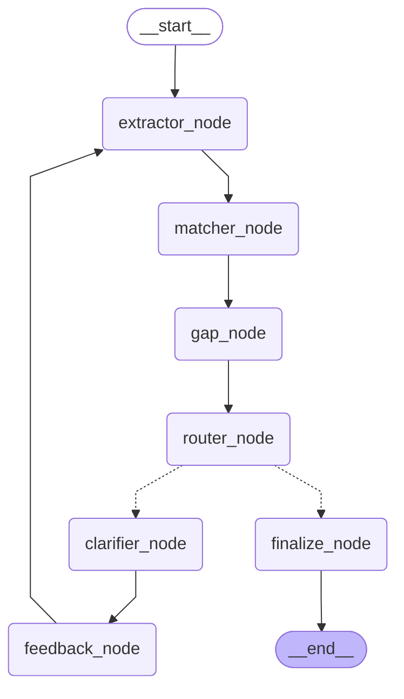

# FS-ID Agentic Loop Visualization

```mermaid
---
config:
  flowchart:
    curve: linear
---
graph TD;
	__start__([<p>__start__</p>]):::first
	extractor_node(extractor_node)
	matcher_node(matcher_node)
	gap_node(gap_node)
	router_node(router_node)
	clarifier_node(clarifier_node)
	feedback_node(feedback_node)
	finalize_node(finalize_node)
	__end__([<p>__end__</p>]):::last
	__start__ --> extractor_node;
	clarifier_node --> feedback_node;
	extractor_node --> matcher_node;
	feedback_node --> extractor_node;
	gap_node --> router_node;
	matcher_node --> gap_node;
	router_node -.-> clarifier_node;
	router_node -.-> finalize_node;
	finalize_node --> __end__;
	classDef default fill:#f2f0ff,line-height:1.2
	classDef first fill-opacity:0
	classDef last fill:#bfb6fc

```
